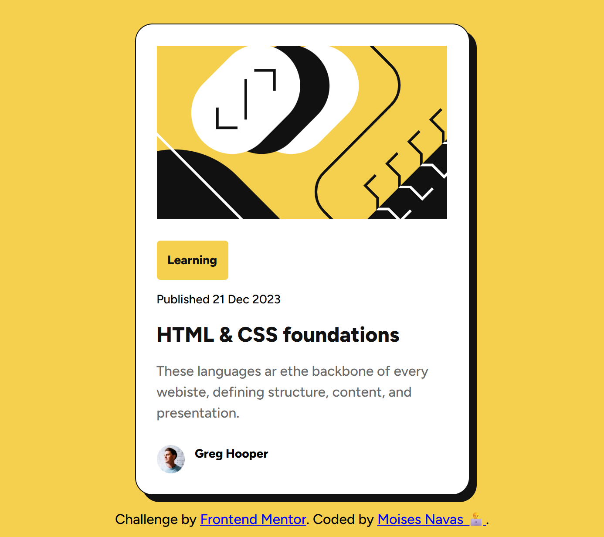

# Frontend Mentor - Blog preview card solution

This is a solution to the [Blog preview card challenge on Frontend Mentor](https://www.frontendmentor.io/challenges/blog-preview-card-ckPaj01IcS). Frontend Mentor challenges help you improve your coding skills by building realistic projects.

## Table of contents

- [Overview](#overview)
  - [The challenge](#the-challenge)
  - [Screenshot](#screenshot)
  - [Links](#links)
- [My process](#my-process)
  - [Built with](#built-with)
  - [What I learned](#what-i-learned)
- [Author](#author)

## Overview

### The challenge

Users should be able to:

- See hover and focus states for all interactive elements on the page

### Screenshot



### Links

- Solution URL: [https://github.com/mnav08/preview-card.git]
- Live Site URL: [https://mnav08.github.io/preview-card/]

## My process

### Built with

- Semantic HTML5 markup
- CSS custom properties
- Flexbox
- Hover states

### What I learned

In this project I learned how to add shadow to a the border of a container.

```css
box-shadow: var(--space-100) var(--space-100) 0 var(--gray-950);
```

### AI Collaboration

I used GitHUb Copilot in my IDE to explain to me and break down the syntax of the box-shadow property and then I applied that new knowledge into my project.

## Author

Moises Navas

- Website - [https://github.com/mnav08]
- Frontend Mentor - [https://www.frontendmentor.io/profile/mnav08]
